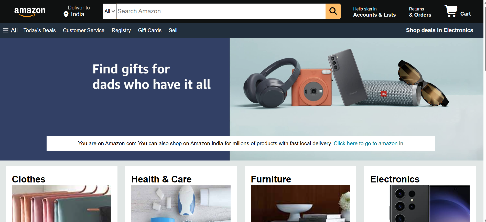

# Amazon Clone

A front-end clone of the Amazon website built using **HTML5** and **CSS3**. This project replicates the look and layout of Amazon's homepage and was built to practice responsive design and page structure.

> **Disclaimer:** This project is for educational purposes only. It is not affiliated with, endorsed by, or connected to Amazon.com, Inc. All trademarks and logos belong to their respective owners.

## Features
- Header with logo, search bar, location selector, account and cart links
- Navigation bar with category links
- Hero banner / image section
- Product cards grid (e.g. "Deals", "Top Picks")
- Footer with link sections and "Back to top"
- Responsive layout using Flexbox / CSS Grid
- Hover effects on buttons, cards, and links

## Tech Stack
- HTML5
- CSS3

## Getting Started
1. Clone the repository
   `git clone https://github.com/your-username/amazon-clone.git`
2. Open the project folder
   `cd amazon-clone`
3. Open `index.html` in your browser

## Live Demo
[ https://suhani-sahu.github.io/Amazon-clone/ ]

## Screenshots

## Folder Structure
├── index.html
├── style.css
└── images/

## Future Improvements
- Add JavaScript for a working cart and search
- Add product detail and sign-in pages
- Improve accessibility and mobile layout

## License
Open source under the [MIT License](LICENSE).
